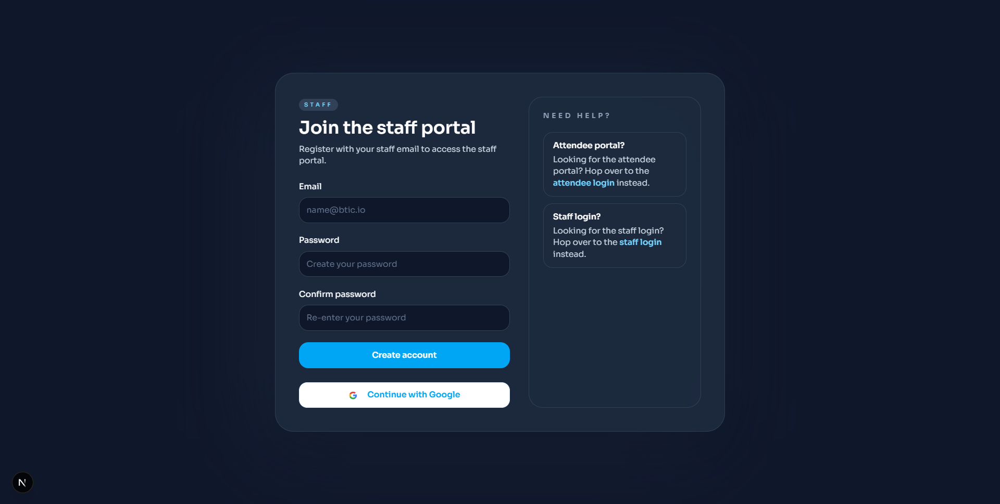
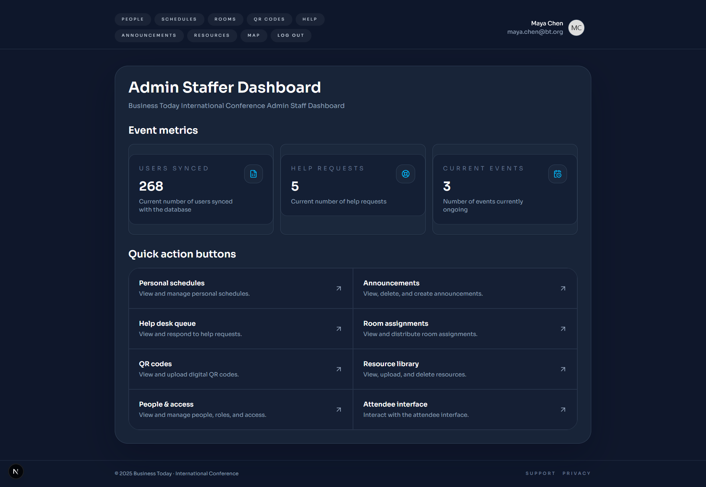
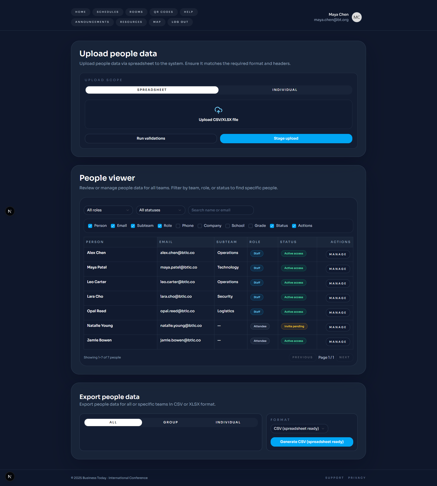
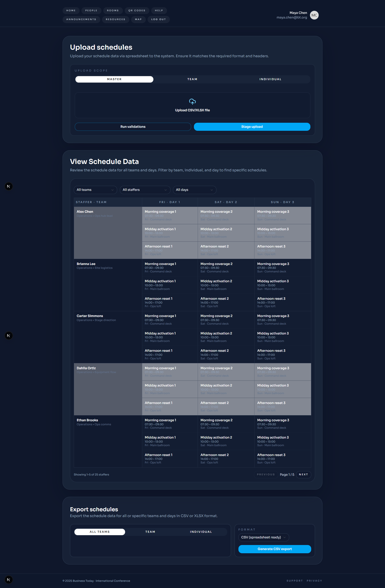
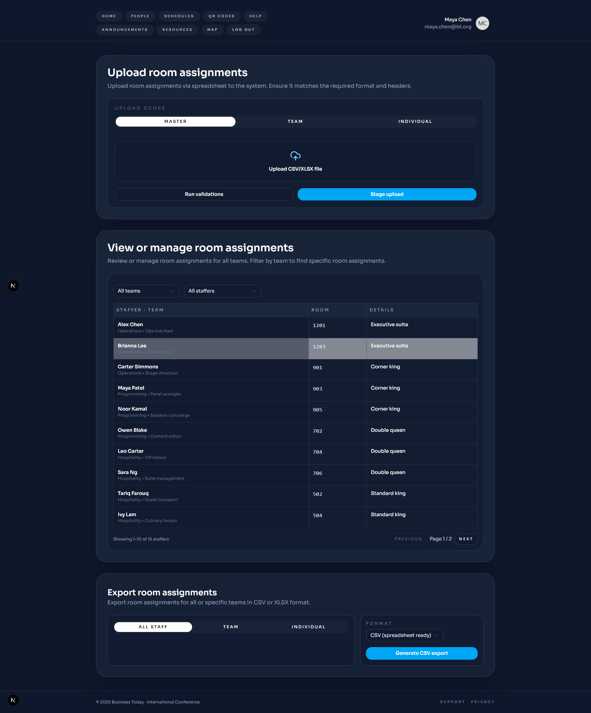
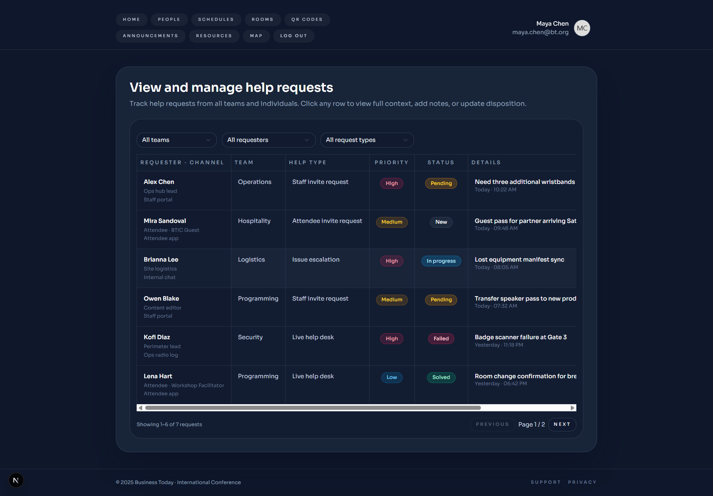
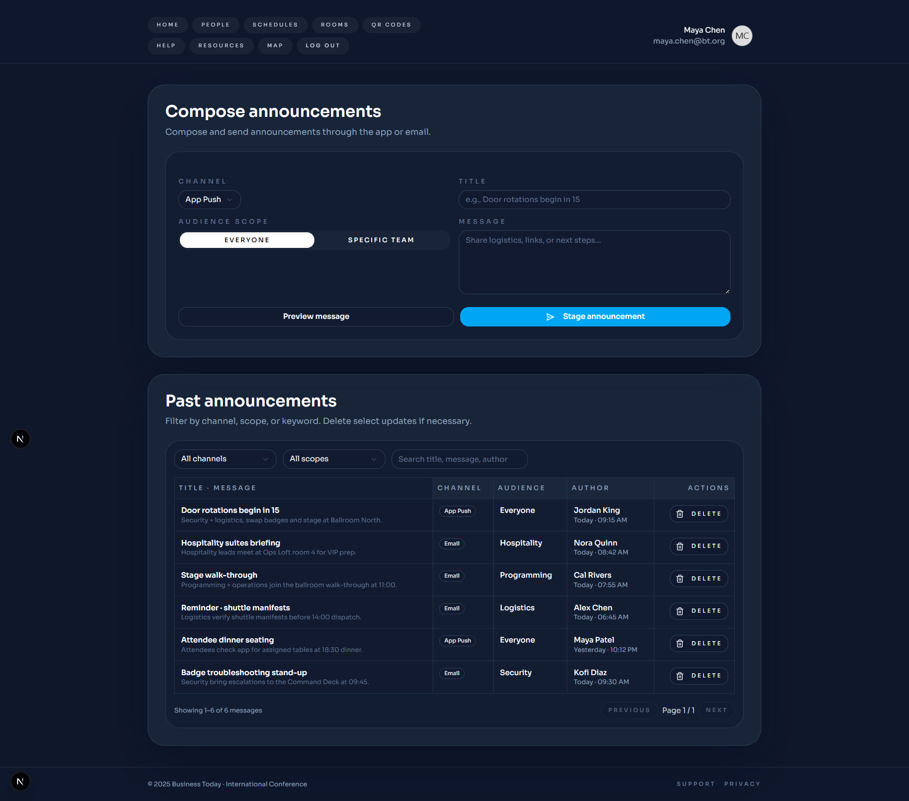
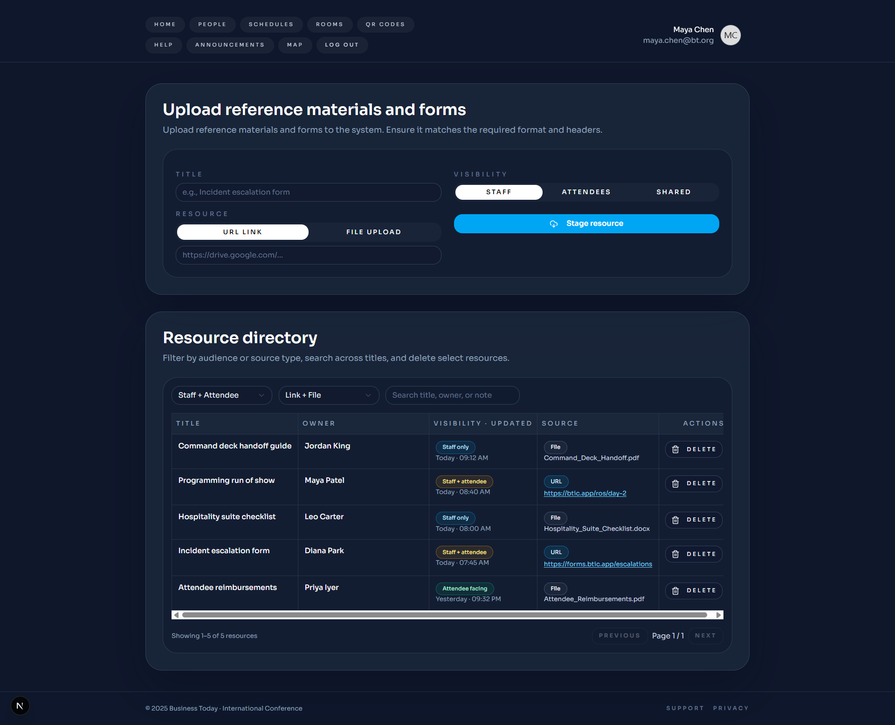
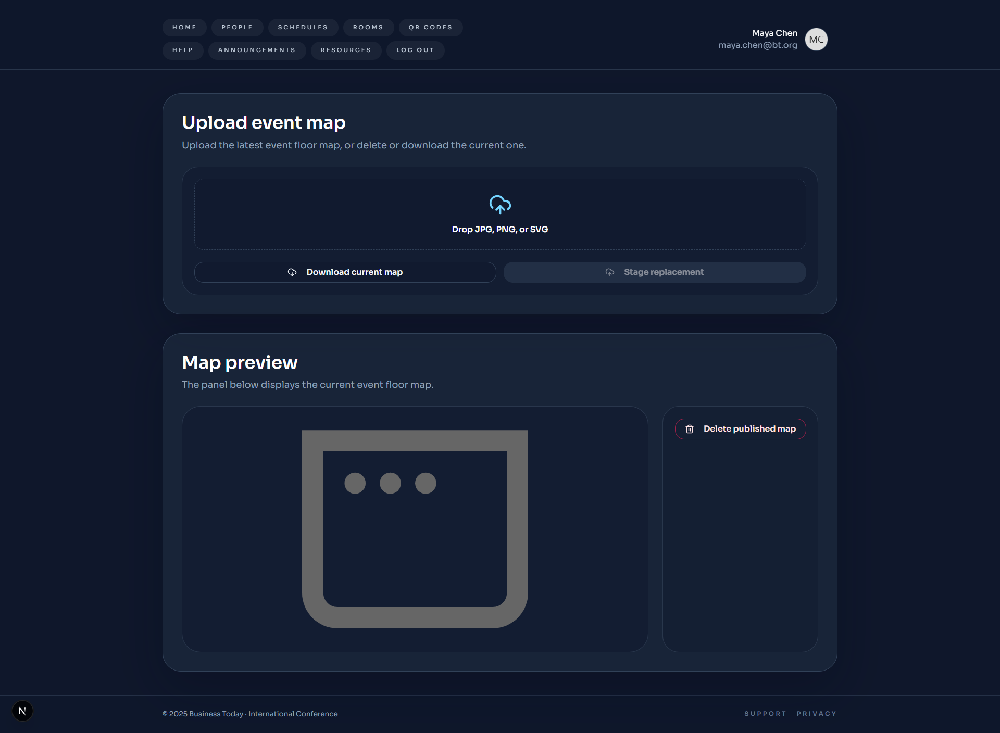

Next.js web application for managing Business Today International Conference operations, featuring staff and attendee portals for schedule management, people administration, announcements, help desk queue, resource library, QR code management, and room assignments. Built using Next.js, React, TypeScript, Tailwind CSS, and Firebase. 

This project is incomplete/in-development.

  
  
  
  
  
  
  
  
  

